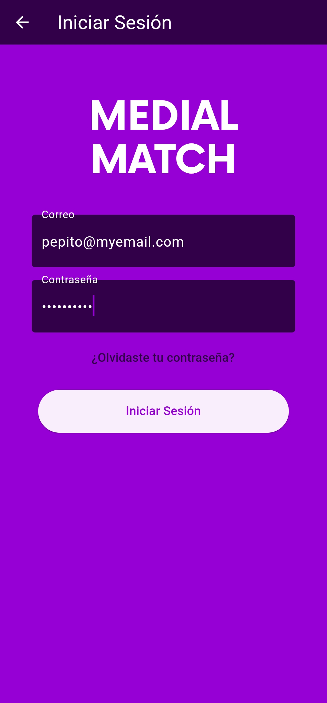

### A Flutter based cross-platform application to offer freelance services in the audiovisual industry

## 📽️ Demo

Video doesn't load? Visit: [Watch on Youtube](https://www.youtube.com/watch?v=RREbE4TfB-o&ab_channel=%C3%81ngelTalero)

<iframe width="560" height="315" src="https://www.youtube.com/embed/RREbE4TfB-o?si=I-icSXwvaRfj0uv3" title="YouTube video player" frameborder="0" allow="accelerometer; autoplay; clipboard-write; encrypted-media; gyroscope; picture-in-picture; web-share" referrerpolicy="strict-origin-when-cross-origin" allowfullscreen></iframe>

## 🖼️ Screenshots
All the screenshots can be found in [docs/screenshots](docs/screenshots)

|                                          |                                    |
| ---------------------------------------- | ---------------------------------- |
|  |  |

|                                         |                                        |                                            |
| --------------------------------------- | -------------------------------------- | ------------------------------------------ |
|  |  |  |

## 🛠️ Code Generation
Run the following commands in separate terminals and leave them running while coding so code generations happen when files change:

	dart run slang watch
	dart run build_runner watch

## 🏗️ Compilation

__'flutter_native_splash'__ and __'flutter_launcher_icons'__ require building before running the application, use the following commands:

```sh
dart pub get
dart run flutter_native_splash:create
dart run flutter_launcher_icons
```

__slang__ and __freezed__ packages require code generation before building the application, use the following commands:
```sh
dart run slang build
dart run build_runner build
```

### Release Build
In order to relese build the app you need to precompile the SKSL shaders, you can use the provided __'flutter_01.sksl.json'__ file or provide your own via the command:
```sh
flutter run --profile --cache-sksl --purge-persistent-cache --dump-skp-on-shader-compilation
```
Trigger as much animations as you can and then press __M__ inside the command-line to export the __'flutter_01.sksl.json'__ file

Then compile the __.apk__ application using the following command
```sh
flutter build apk --obfuscate --split-debug-info=build/app/output/symbols --no-track-widget-creation --release --bundle-sksl-path flutter_01.sksl.json --no-tree-shake-icons -v
```